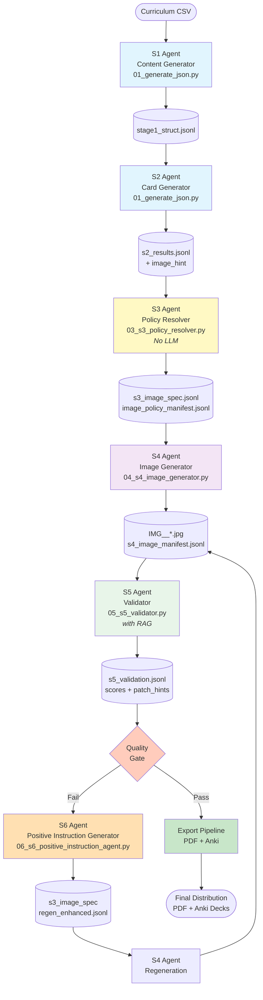
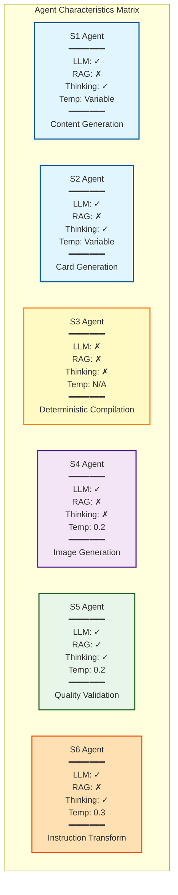
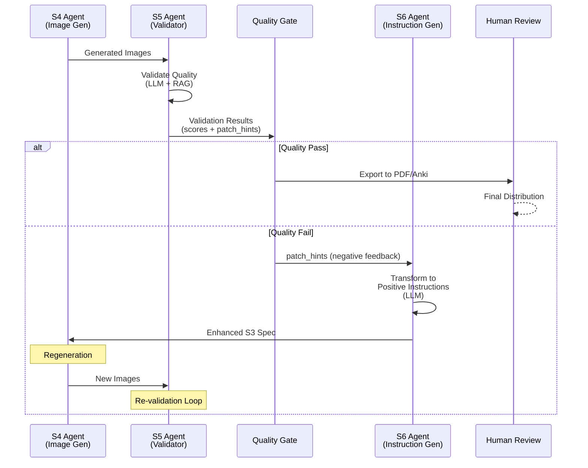
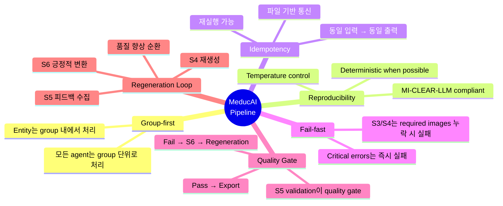

# MeducAI Agent Architecture - Mermaid Diagrams

## 전체 파이프라인 플로우

## Agent 간 데이터 플로우 (상세)

```mermaid
graph LR
    subgraph Input
        CSV[groups_canonical.csv]
        Objectives[Learning Objectives]
    end
    
    subgraph "S1: Content Generation"
        S1_LLM[Gemini Pro/Flash]
        S1_Output[stage1_struct.jsonl<br/>- Master Table<br/>- Entity List]
    end
    
    subgraph "S2: Card Generation"
        S2_LLM[Gemini Pro/Flash]
        S2_Output[s2_results.jsonl<br/>- Q1/Q2 Cards<br/>- image_hint]
    end
    
    subgraph "S3: Policy Resolution"
        S3_Compiler[Deterministic Compiler<br/>NO LLM]
        S3_Output1[image_policy_manifest.jsonl]
        S3_Output2[s3_image_spec.jsonl]
    end
    
    subgraph "S4: Image Generation"
        S4_LLM[Gemini Pro/Flash<br/>Image Generation]
        S4_Output1[IMG__*.jpg]
        S4_Output2[s4_image_manifest.jsonl]
    end
    
    subgraph "S5: Validation"
        S5_LLM[Gemini Pro<br/>with RAG]
        S5_RAG[RAG Evidence]
        S5_Output[s5_validation.jsonl<br/>- scores<br/>- patch_hints]
    end
    
    subgraph "S6: Regeneration Instructions"
        S6_LLM[Gemini Flash<br/>Transformation]
        S6_Output[s3_image_spec<br/>regen_enhanced.jsonl]
    end
    
    CSV --> S1_LLM
    Objectives --> S1_LLM
    S1_LLM --> S1_Output
    
    S1_Output --> S2_LLM
    S2_LLM --> S2_Output
    
    S2_Output --> S3_Compiler
    S1_Output --> S3_Compiler
    S3_Compiler --> S3_Output1
    S3_Compiler --> S3_Output2
    
    S3_Output2 --> S4_LLM
    S4_LLM --> S4_Output1
    S4_LLM --> S4_Output2
    
    S1_Output --> S5_LLM
    S2_Output --> S5_LLM
    S4_Output1 --> S5_LLM
    S5_RAG --> S5_LLM
    S5_LLM --> S5_Output
    
    S5_Output --> S6_LLM
    S3_Output2 --> S6_LLM
    S4_Output1 --> S6_LLM
    S6_LLM --> S6_Output
    
    S6_Output -.Regeneration Loop.-> S4_LLM
    
    style S1_LLM fill:#bbdefb
    style S2_LLM fill:#bbdefb
    style S3_Compiler fill:#fff59d
    style S4_LLM fill:#e1bee7
    style S5_LLM fill:#c8e6c9
    style S5_RAG fill:#a5d6a7
    style S6_LLM fill:#ffcc80
```

## Agent 특성 및 역할

## 재생성 루프 (Regeneration Loop)

## 파일 구조 및 Agent 매핑

```mermaid
graph TD
    subgraph "3_Code/src/ - Core Agents"
        F1[01_generate_json.py<br/>S1 + S2 Agents]
        F3[03_s3_policy_resolver.py<br/>S3 Agent]
        F4[04_s4_image_generator.py<br/>S4 Agent]
        F5[05_s5_validator.py<br/>S5 Agent]
        F6[06_s6_positive_instruction_agent.py<br/>S6 Agent]
        F7[07_build_set_pdf.py<br/>PDF Exporter]
        F8[07_export_anki_deck.py<br/>Anki Exporter]
    end
    
    subgraph "3_Code/prompt/ - Prompts"
        P1[S1_SYSTEM__v8.md]
        P2[S2_SYSTEM__v7.md]
        P4[S4_IMAGE_*.md]
    end
    
    subgraph "2_Data/metadata/generated/<run_tag>/ - Outputs"
        O1[stage1_struct__arm*.jsonl]
        O2[s2_results__arm*.jsonl]
        O3[s3_image_spec__arm*.jsonl]
        O4[s4_image_manifest__arm*.jsonl<br/>IMG__*.jpg]
        O5[s5_validation__arm*.jsonl]
    end
    
    F1 -.uses.-> P1
    F1 -.uses.-> P2
    F4 -.uses.-> P4
    
    F1 --> O1
    F1 --> O2
    F3 --> O3
    F4 --> O4
    F5 --> O5
    
    style F1 fill:#e1f5fe
    style F3 fill:#fff9c4
    style F4 fill:#f3e5f5
    style F5 fill:#e8f5e9
    style F6 fill:#ffe0b2
    style F7 fill:#c8e6c9
    style F8 fill:#c8e6c9
```

## Design Principles

---

**Note**: 이 다이어그램들은 GitHub, Notion, 또는 Mermaid를 지원하는 마크다운 뷰어에서 렌더링됩니다.

