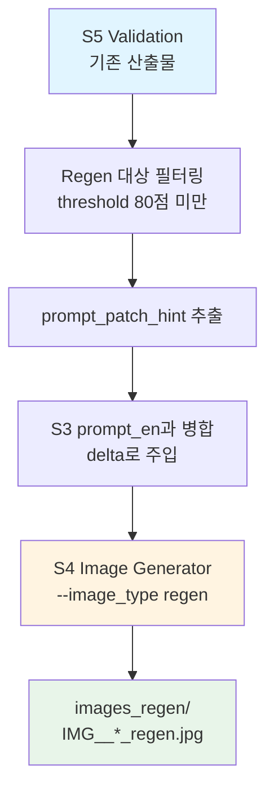

# S5 Positive Regen Procedure (Option C Image Regeneration)

**Status**: Operational Guide (구현 완료, 2026-01-05)  
**Scope**: S5 Validation → Image Regeneration (Positive Instructions)  
**Core Principle**: S5 `prompt_patch_hint` 기반 이미지 재생성 (Same RUN_TAG, 스키마 변경 없음)

---

## 1. 정의 및 목적

### 1.1 Positive Regen이란?

**Positive Regen(Positive Regeneration)**은 S5 validation 결과에서:
- `image_regeneration_trigger_score < threshold` (기본값: 80점)인 카드를 대상으로
- S5가 제안한 `prompt_patch_hint`(개선 제안)를 **positive instructions**로 변환하여
- S3 원본 `prompt_en`에 **delta로 추가 주입**하여
- S4 Image Generator를 재호출해 **향상된 이미지를 재생성**하는 절차

### 1.2 목적

1. **품질 향상**: S5 검증에서 threshold 미만 이미지를 자동 개선
2. **효율성**: 전체 pipeline 재실행 없이 이미지만 선택적 재생성
3. **추적성**: 원본 보존 + 별도 폴더/파일명으로 regen 이미지 관리
4. **스키마 일관성**: S5 스키마 변경 없이 기존 `prompt_patch_hint` 필드 활용

---

## 2. Option C 아키텍처 개요

### 2.1 전체 흐름



### 2.2 핵심 원칙

1. **S5 스키마 변경 없음**: 기존 `prompt_patch_hint` 필드 재사용
2. **Same RUN_TAG**: regen 이미지는 baseline과 동일한 RUN_TAG 사용
3. **폴더/파일명 분리**: `images_regen/` + `_regen` suffix로 구분
4. **Manifest 분리**: `s4_image_manifest__armX__regen.jsonl` (baseline 덮어쓰기 방지)
5. **S3 원본 재사용**: 원본 `prompt_en` + `prompt_patch_hint` delta만 추가

---

## 3. 파일 및 폴더 구조

### 3.1 Directory Layout

```
2_Data/metadata/generated/{RUN_TAG}/
├── images/                              # baseline 이미지
│   └── IMG__{RUN_TAG}__{group_id}__{entity_id}__Q1.jpg
├── images_regen/                        # regen 이미지 (NEW)
│   └── IMG__{RUN_TAG}__{group_id}__{entity_id}__Q1_regen.jpg
├── s3_image_spec__armX__original_diagram.jsonl  # 원본 spec (보존)
├── s3_image_spec__armX__regen_positive_v1.jsonl # regen spec (NEW)
├── s4_image_manifest__armX.jsonl                # baseline manifest
├── s4_image_manifest__armX__regen.jsonl         # regen manifest (NEW)
├── s5_validation_results__armX.jsonl            # S5 결과 (prompt_patch_hint 포함)
└── ...
```

### 3.2 파일명 규칙

**Baseline:**
- 폴더: `images/`
- 파일명: `IMG__{RUN_TAG}__{group_id}__{entity_id}__{card_role}.jpg`
- Manifest: `s4_image_manifest__armX.jsonl`

**Regen:**
- 폴더: `images_regen/`
- 파일명: `IMG__{RUN_TAG}__{group_id}__{entity_id}__{card_role}_regen.jpg`
- Manifest: `s4_image_manifest__armX__regen.jsonl`

**Rationale:** Same RUN_TAG 유지 + 폴더/suffix로 구분 → S5 validation 데이터 재사용 가능

---

## 4. S5 `prompt_patch_hint` 필드 활용

### 4.1 S5 Schema (변경 없음)

S5 validation result (`s5_validation_results__armX.jsonl`)에서:

```json
{
  "group_id": "grp_...",
  "entity_id": "DERIVED_...",
  "card_role": "Q1",
  "image_regeneration_trigger_score": 85,
  "prompt_patch_hints": [
    "Ensure the MRI slice shows clear T2-weighted hyperintensity in the right frontal lobe.",
    "Add more prominent mass effect with midline shift."
  ]
}
```

**핵심 필드:**
- `image_regeneration_trigger_score < 90`: regen 대상
- `prompt_patch_hints`: S5가 제안한 개선사항 리스트 (positive instructions)

### 4.2 Positive Instructions 변환

S3 원본 prompt_en:
```
You are a board-certified radiologist...
TARGET: Group ID: grp_..., Entity: ..., Card Role: Q1
IMAGE_HINT: modality: MRI, anatomy: Brain, ...
```

Regen enhanced prompt_en (delta 추가):
```
You are a board-certified radiologist...
TARGET: Group ID: grp_..., Entity: ..., Card Role: Q1
IMAGE_HINT: modality: MRI, anatomy: Brain, ...

MODIFICATION REQUIREMENTS:
- Ensure the MRI slice shows clear T2-weighted hyperintensity in the right frontal lobe.
- Add more prominent mass effect with midline shift.
```

**원칙:**
- 원본 prompt_en은 그대로 유지
- `MODIFICATION REQUIREMENTS:` 섹션으로 delta 추가
- S5 `prompt_patch_hints`를 positive instructions로 변환

---

## 5. 실행 절차

### 5.1 전제 조건

1. S5 validation 완료: `s5_validation_results__armX.jsonl` 존재
2. S3 원본 spec 보존: `s3_image_spec__armX__original_diagram.jsonl`
3. Gemini API 키 설정: `GOOGLE_API_KEY` 환경 변수

### 5.2 실행 단계

#### Step 1: S3 Spec 정리 (선택사항)

원본 spec을 보존하고 명확한 네이밍으로 관리:

```bash
python 3_Code/Scripts/organize_s3_specs.py \
  --run_tag FINAL_DISTRIBUTION \
  --arm G \
  --dry_run  # 테스트용
```

**결과:**
- `s3_image_spec__armG.jsonl` → `s3_image_spec__armG__original_diagram.jsonl` (rename)

#### Step 2: Positive Regen 실행

```bash
python 3_Code/src/tools/regen/positive_regen_runner.py \
  --base_dir . \
  --run_tag FINAL_DISTRIBUTION \
  --arm G \
  --threshold 80.0 \
  --workers 4 \
  --dry_run  # 테스트용 (실제 실행 시 제거)
```

**주요 옵션:**
- `--threshold`: regen 대상 score 기준 (기본값: 80.0)
- `--workers`: 병렬 처리 worker 수 (기본값: 4)
- `--image_model`: Flash 또는 Pro 모델 지정 (선택사항)
- `--only_entity_id`: 특정 entity만 regen (테스트용)
- `--dry_run`: 실제 이미지 생성 없이 시뮬레이션

#### Step 3: 결과 검증

**생성된 파일 확인:**
```bash
ls -lh 2_Data/metadata/generated/FINAL_DISTRIBUTION/images_regen/
ls -lh 2_Data/metadata/generated/FINAL_DISTRIBUTION/s3_image_spec__armG__regen_positive_v1.jsonl
ls -lh 2_Data/metadata/generated/FINAL_DISTRIBUTION/s4_image_manifest__armG__regen.jsonl
```

**Manifest 비교:**
```bash
# Baseline manifest (보존됨)
head -n 1 2_Data/metadata/generated/FINAL_DISTRIBUTION/s4_image_manifest__armG.jsonl

# Regen manifest (새로 생성됨)
head -n 1 2_Data/metadata/generated/FINAL_DISTRIBUTION/s4_image_manifest__armG__regen.jsonl
```

---

## 6. 제약사항 및 권장사항

### 6.1 모델 선택

**권장:**
- **카드 이미지**: Flash 모델 (비용 효율적)
- **인포그래픽**: Pro 모델 (복잡한 구조 처리)

**CLI 옵션:**
```bash
# Flash 모델 사용 (기본값)
--image_model "gemini-2.0-flash-exp"

# Pro 모델 사용 (고품질)
--image_model "gemini-1.5-pro"
```

### 6.2 실행 환경

**Batch API 지원:**
- Batch API 사용 시: `3_Code/src/tools/batch/batch_image_generator.py`
- `--image_type regen` 옵션 지원 확인

**병렬 처리:**
- `--workers` 옵션으로 병렬도 조절
- API quota 고려하여 적절한 worker 수 설정

### 6.3 품질 관리

**필수 검증:**
1. Baseline manifest 보존 확인 (`s4_image_manifest__armX.jsonl` 덮어쓰기 없음)
2. Regen 이미지 파일명 규칙 준수 (`_regen` suffix)
3. S5 `prompt_patch_hint` 반영 여부 육안 확인

**권장 워크플로우:**
1. Dry-run으로 대상 카드 및 prompt 확인
2. 소규모 테스트 (2-3개 entity)
3. 전체 실행

---

## 7. AppSheet/QA 통합

### 7.1 AppSheet 경로 설정

**Baseline 이미지:**
- 경로: `generated/{RUN_TAG}/images_anki/{media_filename}`

**Regen 이미지:**
- 경로: `generated/{RUN_TAG}/images_regen/{media_filename_regen}`

**AppSheet 폼 설정:**
- Regen 이미지 참조 필드 추가 (선택사항)
- Baseline vs Regen 비교 뷰 구성

### 7.2 S5 Final Assessment 연계

S5 Final Assessment 워크플로우에서:
- `s5_regenerated_*` 필드와 Positive Regen 연계
- Regen 이미지를 최종 QA에서 평가

---

## 8. 운영 체크리스트

### 8.1 실행 전

- [ ] S5 validation 완료 확인
- [ ] `GOOGLE_API_KEY` 환경 변수 설정
- [ ] Baseline manifest 백업 (선택사항)
- [ ] Dry-run으로 대상 카드 확인

### 8.2 실행 중

- [ ] Regen spec 생성 확인 (`s3_image_spec__armX__regen_positive_v1.jsonl`)
- [ ] S4 이미지 생성 진행 확인
- [ ] 에러 로그 모니터링

### 8.3 실행 후

- [ ] `images_regen/` 폴더 생성 확인
- [ ] Regen manifest 생성 확인 (`s4_image_manifest__armX__regen.jsonl`)
- [ ] Baseline manifest 보존 확인 (덮어쓰기 없음)
- [ ] 생성된 이미지 품질 샘플링 확인
- [ ] `prompt_patch_hint` 반영 여부 육안 확인

---

## 9. 트러블슈팅

### 9.1 일반적인 이슈

**문제: Baseline manifest가 덮어써짐**
- **원인**: S4 manifest 경로 분리 미적용
- **해결**: `04_s4_image_generator.py` 패치 확인 (2026-01-05 적용됨)

**문제: Regen 이미지가 `images/` 폴더에 생성됨**
- **원인**: `--image_type regen` 옵션 누락
- **해결**: `positive_regen_runner.py`에서 S4 호출 시 `--image_type regen` 전달 확인

**문제: `prompt_patch_hint`가 반영되지 않음**
- **원인**: S3 prompt 병합 로직 오류
- **해결**: `build_positive_instructions()` 함수 검증

### 9.2 로그 및 디버깅

**Dry-run 모드:**
```bash
python 3_Code/src/tools/regen/positive_regen_runner.py \
  --run_tag FINAL_DISTRIBUTION \
  --arm G \
  --dry_run
```

**로그 출력 확인:**
- Regen 대상 카드 수
- `prompt_patch_hint` 추출 내역
- S3 spec 로드 성공 여부
- S4 호출 파라미터

---

## 10. 관련 문서

**Protocol 문서:**
- `S5_Multiagent_Repair_Plan_OptionC_Canonical.md`: Option C 아키텍처 전체
- `S5_Validation_Schema_Canonical.md`: S5 스키마 정의
- `S3_to_S4_Input_Contract_Canonical.md`: S3→S4 계약
- `Image_Asset_Naming_and_Storage_Convention.md`: 파일명/폴더 규칙

**Code 문서:**
- `3_Code/src/04_s4_image_generator.py`: S4 Image Generator
- `3_Code/src/tools/regen/positive_regen_runner.py`: Positive Regen Runner
- `3_Code/Scripts/organize_s3_specs.py`: S3 Spec 정리 스크립트

---

## 11. 버전 이력

**v1.0 (2026-01-05):**
- 초기 버전 작성
- Option C 아키텍처 구현 완료
- S4 manifest 분리 패치 적용
- Same RUN_TAG + 폴더/suffix 분리 정책 확정

